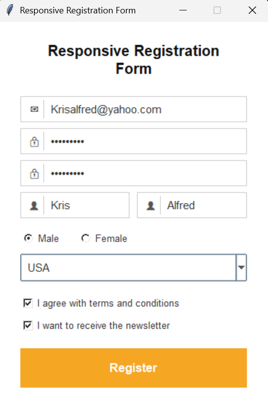
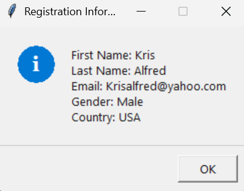

# KrisAlfred_GUI

A collection of registration forms built with Python's Tkinter library, featuring both advanced and basic versions.

## Available Versions

### Advanced Version (`registration_form.py`)

A modern, colorful registration form with advanced UI features.

**Features:**

- **Modern UI Design**: Deep slate and emerald green color scheme
- **Interactive Elements**: Focus-aware input fields with icons and glow effects
- **Form Validation**: Comprehensive validation with error messages
- **Responsive Layout**: Scrollable interface that adapts to content
- **User-Friendly**: Placeholder text, hover effects, and smooth interactions

**Color Palette:**

- Background: Deep Slate (#1e2530)
- Cards: Dark Blue-Gray (#252d3a)
- Accent: Emerald Green (#00b894)
- Text: Light Gray (#e2e8f0)
- Error: Red tones (#fc8181)

### Basic Version (`basic_registration_form.py`)

A clean, simple registration form with essential functionality.

**Features:**

- **Clean UI Design**: Light theme with simple white and gray colors
- **Essential Form Elements**: Email, password, name, gender, country selection
- **Form Validation**: Basic validation with error messages
- **Fixed Layout**: Clean, organized design with proper spacing
- **User-Friendly**: Placeholder text and clear visual feedback

**Color Palette:**

- Background: White (#ffffff)
- Borders: Light Gray (#cccccc)
- Text: Dark Gray (#333333)
- Icons: Medium Gray (#555555)
- Accent: Yellow (#f5a623)
- Error: Red (#cc0000)

## Requirements

- Python 3.x
- Tkinter (included with Python)

## How to Run

### Advanced Version

```bash
python registration_form.py
```

### Basic Version

```bash
python basic_registration_form.py
```

## Basic Version Screenshots





## Form Fields (Both Versions)

- Email Address
- Password (with confirmation)
- Full Name (First & Last)
- Gender Selection
- Country Dropdown
- Terms & Conditions Agreement
- Newsletter Subscription

## Design Features

### Advanced Version

- Custom placeholder entries that disappear on focus
- Bordered input fields with focus glow effects
- Modern button styling with hover states
- Error display with clear messaging
- Information popup for successful registration
- Scrollable canvas for responsive design

### Basic Version

- Simple placeholder entries
- Bordered input fields with icons
- Clean button styling with hover effects
- Error display with clear messaging
- Information popup for successful registration
- Fixed-width responsive design

## Author

Kristopher Alfred

## Author

Kristopher Alfred
